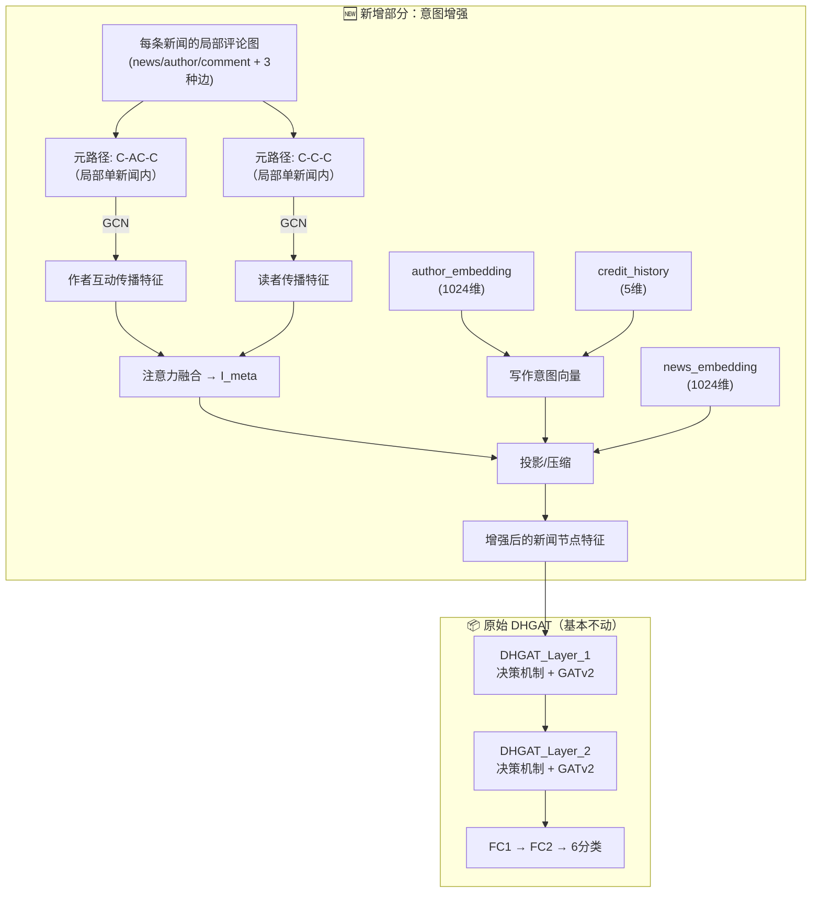
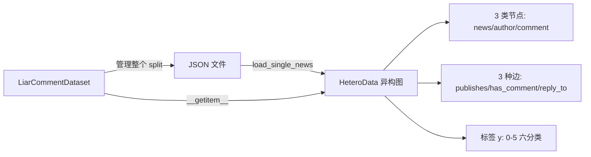
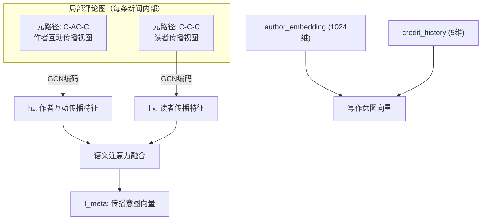
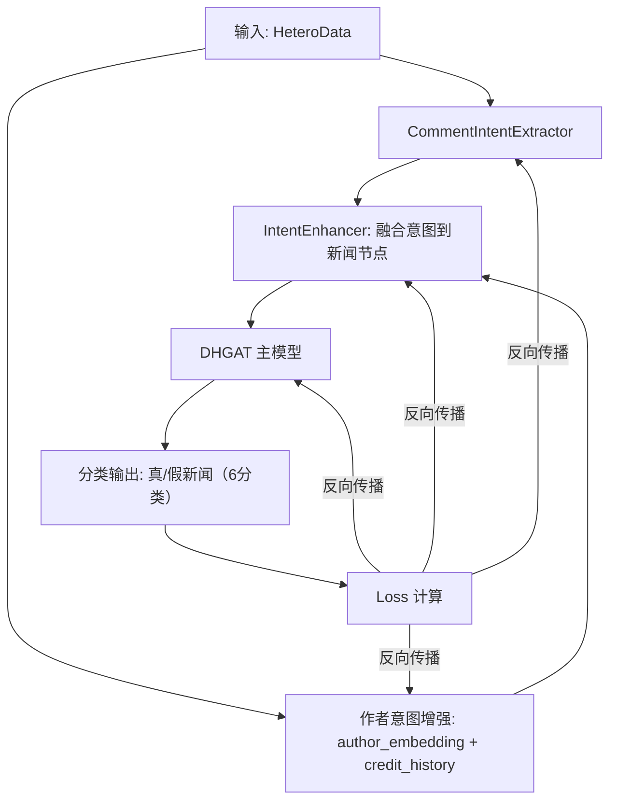
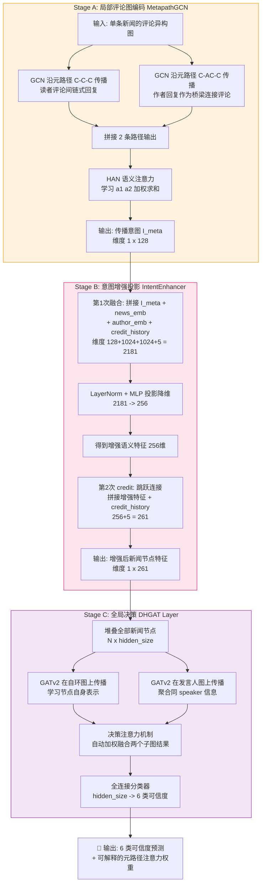
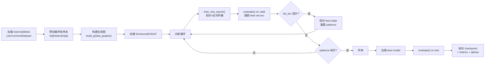

# 实验过程记录

> 项目：基于元路径的意图感知虚假信息检测方法（DHGAT）
> 数据集：LIAR（~12000 条）
> 开始时间：2026-03

---

## 一、项目整体方案

### 核心架构

**核心思路：在原始 DHGAT 前面增加一个「意图增强」预处理步骤，将作者特征（写作意图）和评论传播意图融合到新闻节点特征上，再送入 DHGAT 进行分类。**

```
原始数据 (JSON)
    │
    ├─→ [步骤1] 数据加载 & 异构图构建 (dataset.py)
    │       → PyG HeteroData (3类节点 + 3种核心边)
    │
    ├─→ [步骤2] 元路径子图提取 & GCN编码 (metapath_gcn.py)
    │       → 2条元路径子图(C-AC-C, C-C-C) → 独立GCN编码 → 注意力融合 → I_meta
    │
    ├─→ [步骤3] 意图增强 (intent_enhancer.py)
    │       → concat[news_emb, author_emb, I_meta, credit_history]
    │       → 投影到 hidden_dim → 增强后的新闻节点特征
    │
    ├─→ [步骤4] DHGAT 决策机制 + GATv2聚合（复用原始 DHGAT）
    │       → Gumbel-Softmax 硬选择子图 → GATv2 消息传播
    │
    └─→ [步骤5] 全连接分类 → 6分类
```

**整体流程图**：



### dataset.py 数据流



### 两个创新点

1. **意图增强的新闻节点表示**：通过 2 条评论级元路径 GCN（C-AC-C、C-C-C）提取传播意图（I_meta），结合作者写作意图（author_embedding + credit_history），增强新闻节点的特征表示
2. **与 DHGAT 决策机制的端到端融合**：增强后的特征直接作为 DHGAT 的输入，保留原始决策机制（Gumbel-Softmax 硬选择 + GATv2 聚合），整个流程端到端可训练

### 方案调整记录

| 日期    | 调整内容                                            | 原因                                           |
| ------- | --------------------------------------------------- | ---------------------------------------------- |
| 2026-04 | 去掉 LLM 意图提取模块（It/Is/I_LLM 和门控融合）     | 聚焦两个核心创新点，降低复杂度                 |
| 2026-04 | 元路径子图采用**预构建方式（方式B/HAN路线）** | 数据量中等、有领域先验知识，方式B更合适        |
| 2026-04 | 边类型从 6 种精简到 3 种核心边                      | 去掉 `similar_to`、`likes`、`replies_to`，作者回复合并到 `reply_to` |
| 2026-04 | 元路径从 5 条缩减到先实现 3 条                      | 元路径2（N-C-N）和3（N-C-A）因数据不支持暂缓                      |
| 2026-04 | 确定最终方案：意图增强 + DHGAT 两阶段架构           | 在 DHGAT 前面加意图增强模块，增强新闻节点特征后再走原始 DHGAT 流程 |
| 2026-04 | 去掉 N-A-N 元路径，只保留 C-AC-C 和 C-C-C          | 原始 DHGAT 的 speaker 子图已覆盖 N-A-N 语义；写作意图改用 author_embedding + credit_history 直接表达 |
| 2026-04 | credit_history 采用跨层特征复用（两次使用）          | 第1次在 IntentEnhancer 内部作为融合引导信号；第2次在增强后直接拼接保留原始信号，借鉴 DenseNet 密集连接思想 |

---

## 二、数据准备

### 数据目录结构

| 目录                                  | 内容                                                            |
| ------------------------------------- | --------------------------------------------------------------- |
| `data/comment_networks_embeddings/` | LLM 生成的评论网络 + 1024维 Qwen3-Embedding（train/valid/test） |
| `data/comment_networks/`            | 原始评论网络 JSON                                               |
| `data/_backup/`                     | 旧数据备份                                                      |

### 异构图设计

**节点类型（3类）**：

| 节点类型    | 说明     |
| ----------- | -------- |
| `news`    | 新闻节点 |
| `author`  | 作者节点 |
| `comment` | 评论节点 |

**边类型（3种核心边）**：

| 边类型          | 语义                                         |
| --------------- | -------------------------------------------- |
| `publishes`   | 作者 → 新闻                                 |
| `has_comment` | 新闻 → 直接评论                             |
| `reply_to`    | 评论 → 评论（读者链式回复 + 作者回复评论） |

> **说明**：作者回复在数据中也是评论节点（通过 `is_author_reply` 标签区分），因此作者回复→被回复评论 也走 `reply_to` 边，不再单独设 `replies_to` 边类型。

### 元路径设计（5条 → 最终实现2条）

**原始设计（5条）**：

| 编号 | 元路径 | 语义                       |
| ---- | ------ | -------------------------- |
| 1    | N-A-N  | 同作者发布的新闻           |
| 2    | N-C-N  | 被同一评论关联的新闻       |
| 3    | N-C-A  | 新闻-评论-作者的跨类型路径 |
| 4    | C-AC-C | 评论-作者评论-评论         |
| 5    | C-C-C  | 评论链式回复路径           |

**可行性分析**：

| 元路径  | 路径   | 构建层面         | 能否在当前数据下实现？ | 原因                                        |
| ------- | ------ | ---------------- | :--------------------: | ------------------------------------------- |
| 元路径1 | N-A-N  | 全局（跨新闻）   |     ✅ 但不采用      | 原始 DHGAT 的 speaker 子图已覆盖此语义      |
| 元路径2 | N-C-N  | 需跨新闻评论     |           ❌           | 评论由LLM针对单条新闻生成，不存在跨新闻评论 |
| 元路径3 | N-C-A  | 需跨新闻         |           ❌           | 单图内只有一个作者一条新闻，信息量不足      |
| 元路径4 | C-AC-C | 局部（单新闻内） |           ✅           | 作者回复连接不同评论，单图内天然存在        |
| 元路径5 | C-C-C  | 局部（单新闻内） |           ✅           | 评论回复链，单图内天然存在                  |

**决策：最终实现2条评论级元路径（C-AC-C、C-C-C）**

> **为什么去掉 N-A-N？** 原始 DHGAT 的 6 种子图中已有 `G_speaker`（同一发言人的新闻连边），这就是 N-A-N 的语义。再做一遍会和原始 DHGAT 重复。写作意图改用 `author_embedding + credit_history` 直接在特征层面表达，与 DHGAT 的 speaker 子图（图结构层面）互补。

| 元路径           | 构建层面         | 节点类型 | 捕获的语义                   |
| ---------------- | ---------------- | -------- | ---------------------------- |
| **C-AC-C** | 局部（单新闻内） | 评论节点 | 作者与读者互动中的传播策略   |
| **C-C-C**  | 局部（单新闻内） | 评论节点 | 读者间传播扩散模式           |

两条元路径 + 作者特征的搭配理由：

1. **传播意图**：C-AC-C 和 C-C-C 从评论网络中提取传播模式（这是原始 DHGAT 完全没有的）
2. **写作意图**：author_embedding（1024维语义向量）+ credit_history（5维信用统计）直接表达作者的写作意图和可信度
3. **与原始 DHGAT 互补不重复**：DHGAT 的 speaker 子图在图结构层面捕获作者关联，我们在特征层面捕获作者语义
4. **数据完全支持**：两条元路径在单图内直接提取，不需要全局预处理

**2条元路径架构图**：



---

## 三、代码进展

| 模块       | 文件                         |   状态   | 说明                                           |
| ---------- | ---------------------------- | :-------: | ---------------------------------------------- |
| 数据加载   | `src/dataset.py`           | ✅ 已完成 | PyG HeteroData 构建（3类节点 + 3种边）         |
| 元路径GCN  | `src/metapath_gcn.py`      | ✅ 已完成 | 2条元路径子图提取 + GCN编码 + 注意力融合→I_meta |
| 意图增强   | `src/intent_enhancer.py`   | ✅ 已完成 | news_emb+author_emb+I_meta+credit→投影增强（credit两次使用）|
| 完整模型   | `src/model.py`             | ✅ 已完成 | IntentEnhancer → DHGAT_Layer → FC → 6分类      |
| 训练入口   | `src/train.py`             | ✅ 已完成 | 端到端训练循环、评估、早停、保存               |

### 3.0 方案设计说明：意图增强 + DHGAT

**核心思想**：不重写 DHGAT，而是在它前面加一个"意图增强"预处理步骤，把作者特征（写作意图）和评论传播意图融合到新闻节点特征上，然后再走原始 DHGAT 流程。

**为什么这样设计？**

1. **改动最小，创新点清晰**：原始 DHGAT 的核心（决策机制 + Gumbel-Softmax + GATv2）完全保留，只在输入特征层面做增强
2. **端到端可训练**：梯度从分类损失一路传回到评论编码器，全部一起更新
3. **消融实验方便**：去掉增强模块就退化回原始 DHGAT，直接对比

**新闻节点特征增强公式（credit_history 跨层特征复用）**：

```
# 第1次使用 credit_history：作为融合引导信号参与 MLP 投影
enhanced_feat = MLP(
    concat[
        news_embedding   (1024维),  ← 替代原来的 300维FastText
        author_embedding (1024维),  ← 作者写作意图（语义）
        credit_history   (5维),     ← 第1次：引导融合方向（作者可信度感知）
        I_meta           (d维)      ← 2条元路径融合的传播意图
    ]
) → [1, hidden_dim]

# 第2次使用 credit_history：跳跃连接，保留原始统计信号
final_feat = concat[enhanced_feat, credit_history]
           → [1, hidden_dim + 5] → 作为 DHGAT 的输入 x
```

**为什么 credit_history 要用两次？**

| | 第1次（IntentEnhancer 内部） | 第2次（增强后拼接） |
|--|--|--|
| **角色** | 融合引导信号 | 原始硬特征 |
| **作用** | 让 MLP 感知作者可信度，影响融合方向 | 让下游分类器直接看到原始可信度数值 |
| **形态** | 经 MLP 投影后编码进 hidden_dim 维抽象表示（隐式） | 原始 5 维数值，未经变换（显式） |

> 这一设计借鉴了 DenseNet [Huang et al., 2017] 中密集连接的思想：让关键的判别性特征在不同抽象层级均可被模型直接访问。类似于 ResNet 的残差连接，credit_history 既参与了变换（第1次），又通过跳跃连接保留了原始信号（第2次），避免低维统计特征在高维投影过程中被稀释。

**端到端训练架构图**：



> **关键点**：所有模块（CommentIntentExtractor → IntentEnhancer → DHGAT）都是 `nn.Module` 子类，在同一个优化器、同一个损失函数下一起更新。一个 `loss.backward()` 梯度一路传回所有子模块，**没有任何两阶段预训练**。

**与原始 DHGAT 的对接**：

| 对比项         | 原始 DHGAT                    | 改进后                                          |
| -------------- | ----------------------------- | ----------------------------------------------- |
| 新闻节点特征   | 305维（5统计值+300维FastText）| (hidden_dim+5)维（投影后的增强特征 + credit_history 跳跃连接）|
| 图结构         | speaker/context等元数据子图   | 同上（复用原始子图构建方式）                    |
| 决策机制       | Gumbel-Softmax硬选择          | 不变                                            |
| GATv2聚合      | 在选中子图上传播              | 不变                                            |
| 分类层         | FC1→FC2→6分类                 | 不变（只需调整input_size）                      |

---

### 3.1 数据加载模块 `src/dataset.py`

**输入**：`data/comment_networks_embeddings/{train,valid,test}/*.json`（每个 JSON = 一条新闻）

**核心函数/类**：

| 函数/类 | 功能 |
| ------- | ---- |
| `LABEL_MAP` | 标签映射字典，将 6 类字符串标签（true/mostly-true/half-true/barely-true/false/pants-fire）映射为 0-5 |
| `load_single_news(json_path)` | 读取单个 JSON 文件，构建一张 PyG `HeteroData` 异构图并返回 |
| `LiarCommentDataset(split_dir)` | 继承 `torch.utils.data.Dataset`，管理整个 split 的数据加载，支持内存缓存 |

**`load_single_news` 详细流程**：

1. **解析标签**：读取 `news_label`，通过 `LABEL_MAP` 映射为整数标签
2. **构建节点特征**：
   - `news.x`：新闻 embedding `[1, 1024]`
   - `author.x`：作者 embedding `[1, 1024]`
   - `comment.x`：所有评论（读者评论 + 作者回复）的 embedding `[N_c, 1024]`
3. **构建 3 种边**：
   - `(author, publishes, news)`：作者→新闻，固定 `[[0],[0]]`
   - `(news, has_comment, comment)`：新闻→直接评论（`parent_id=None` 的评论）
   - `(comment, reply_to, comment)`：评论→评论（读者链式回复 + 作者回复评论，统一走 `reply_to`）
4. **标记作者回复**：`comment.is_author_reply` 布尔张量，标识哪些评论节点是作者发的（用于元路径 C-AC-C）
5. **附加元数据**：`news_id`、`news_speaker`（用于后续元路径 1 N-A-N 的全局分组）

**`LiarCommentDataset` 行为**：

- 初始化时扫描目录下所有 JSON，过滤掉格式异常的文件，记录有效路径
- `__getitem__` 按需调用 `load_single_news` 加载，支持 `cache=True` 缓存到内存避免重复 IO
- 验证结果：train=9770 条，valid/test 各约 1280 条，每条新闻约 10 个评论节点

**输出**：每条数据为一个 `HeteroData` 对象，包含 3 类节点、3 种边、标签 `news.y`、`comment.is_author_reply` 标记、`news.credit_history`（5维信用历史）

---

### 3.2 元路径GCN模块 `src/metapath_gcn.py`

**功能**：从每条新闻的评论图中提取 2 条元路径子图，分别用 GCN 编码，再通过注意力融合为传播意图向量 I_meta。

**核心组件**：

| 组件 | 功能 |
| ---- | ---- |
| `extract_ccc_subgraph()` | 提取 C-C-C 子图：只保留读者评论之间的 reply_to 边（排除作者回复节点） |
| `extract_cacc_subgraph()` | 提取 C-AC-C 子图：保留涉及作者回复节点的 reply_to 边（AC 作为桥梁连接评论） |
| `SingleMetaPathGCN` | 2层 GCN 编码器，输入子图节点特征+边，输出 mean-pooled 图级表示 [1, out_dim] |
| `MetaPathFusion` | HAN 风格语义注意力，将 2 条元路径的表示加权融合为 I_meta |
| `MetaPathEncoder` | 顶层模块，串联子图提取→GCN编码→注意力融合，输出 I_meta [1, out_dim] |

**子图提取逻辑**：

- **C-C-C**：从 `reply_to` 边中筛选出两端都是读者评论（`is_author_reply=False`）的边，重新索引为连续节点编号，双向化后送入 GCN
- **C-AC-C**：从 `reply_to` 边中筛选出至少一端是作者回复（`is_author_reply=True`）的边，保留所有评论节点，双向化后送入 GCN。作者回复节点作为中介，连接不同的读者评论

**边界情况处理**：
- 如果某条元路径子图为空（如没有作者回复），使用可学习的 fallback 零向量代替
- 所有边都做了双向化（`undirected`），确保 GCN 消息能双向传播

**默认超参数**：`in_dim=1024, hidden_dim=128, out_dim=128, dropout=0.3`

**输出**：`I_meta [1, 128]`（传播意图向量）+ `alphas [2]`（注意力权重，可用于可解释性分析）

---

### 3.3 意图增强模块 `src/intent_enhancer.py`

**功能**：将多源特征（新闻语义、作者语义、信用历史、传播意图）融合为增强的新闻节点特征，作为 DHGAT 的输入。

**核心组件**：

| 组件 | 功能 |
| ---- | ---- |
| `CommentIntentExtractor`（内嵌） | 从评论图中提取传播意图 I_meta [1, 128]（复用 metapath_gcn.py） |
| `LayerNorm` | 对拼接后的 2181 维特征做归一化，稳定训练 |
| `MLP`（2层） | 将拼接特征投影到 hidden_dim 维（默认 256） |

**数据流**：

```
HeteroData
    ├─ news_emb      [1, 1024]  ← data["news"].x
    ├─ author_emb    [1, 1024]  ← data["author"].x
    ├─ credit_history [1, 5]    ← data["news"].credit_history
    └─ comment graph            ← CommentIntentExtractor → I_meta [1, 128]

第1次 credit_history（融合引导）：
    concat[news_emb, author_emb, credit, I_meta] → [1, 2181]
    → LayerNorm → Linear(2181→256) → ReLU → Dropout
    → Linear(256→256) → ReLU → enhanced_feat [1, 256]

第2次 credit_history（跳跃连接）：
    concat[enhanced_feat, credit] → [1, 261]
    → 输出：增强后的新闻节点特征
```

**默认超参数**：`news_dim=1024, author_dim=1024, credit_dim=5, intent_dim=128, hidden_dim=256, dropout=0.3`

**输出**：`enhanced [1, 261]`（增强后的新闻节点特征）+ `alphas [2, 1]`（元路径注意力权重，透传自 CommentIntentExtractor）

---

### 3.4 完整模型模块 `src/model.py`

**功能**：组装完整的端到端模型，将意图增强（Stage 1）与原始 DHGAT 骨干网络（Stage 2）串联，输出 6 分类结果。

**核心组件**：

| 组件 | 功能 |
| ---- | ---- |
| `IntentEnhancer`（Stage 1） | 对每条新闻的局部评论图提取增强特征 [1, 261]，逐样本处理后堆叠为 [N, 261] |
| `DHGAT_Layer × 2`（Stage 2） | 在全局元数据子图上进行 Gumbel-Softmax 决策 + GATv2 消息传播（复用原始 DHGAT） |
| `FC1 → FC2`（分类头） | 两层全连接，输出 6 分类概率 |

**数据流**：

```
Stage 1 — 逐样本意图增强（局部评论图）：
    for each news_i in batch:
        HeteroData_i → IntentEnhancer → enhanced_feat_i [1, 261]
    stack → X_enhanced [N, 261]

Stage 2 — 全局图传播（原始 DHGAT 骨干）：
    X_enhanced [N, 261]
    → DHGAT_Layer_1(input=261, output=256) → ReLU → [N, 256]
    → DHGAT_Layer_2(input=256, output=128) → ReLU → [N, 128]

分类头：
    → FC1(128→64) → ReLU → [N, 64]
    → FC2(64→6) → Softmax → [N, 6]
```

**forward() 输入**：

| 参数 | 类型 | 说明 |
| ---- | ---- | ---- |
| `hetero_data_list` | `list[HeteroData]` | 每条新闻的局部评论图（长度 N），与全局图节点顺序一致 |
| `edge_index_dict` | `dict[int, LongTensor]` | 全局元数据子图（0=self-loop, 1=speaker, 2=party, ...），供 DHGAT 决策机制使用 |

**forward() 输出**：

| 输出 | 形状 | 说明 |
| ---- | ---- | ---- |
| `out` | `[N, 6]` | 6 分类概率（softmax） |
| `all_alphas` | `[N, 2]` | 每条新闻的元路径注意力权重（C-AC-C, C-C-C），可用于可解释性分析 |

**默认超参数**：

| 参数 | 默认值 | 说明 |
| ---- | ------ | ---- |
| `hidden_size` | 256 | DHGAT 层隐藏维度 |
| `output_size` | 6 | 分类数（LIAR 6 分类） |
| `decision_size` | 7 | Gumbel-Softmax 候选子图数量 |
| `decision_key` | 1 | 决策 GATv2 使用的子图索引（speaker） |
| `enhancer_hidden` | 256 | IntentEnhancer MLP 隐藏维度 |
| `enhancer_dropout` | 0.3 | IntentEnhancer dropout |
| `gcn_hidden` | 128 | 元路径 GCN 隐藏维度 |
| `gcn_out` | 128 | 元路径 GCN 输出维度 |
| `gcn_dropout` | 0.3 | 元路径 GCN dropout |

**维度传递链**：

```
IntentEnhancer.out_dim = 261 (256 + 5)
    → DHGAT_Layer_1: 261 → 256
    → DHGAT_Layer_2: 256 → 128
    → FC1: 128 → 64
    → FC2: 64 → 6
```

**关键设计点**：
- Stage 1 逐样本处理局部评论图，Stage 2 在全局图上传播，两阶段在同一个 `forward()` 中完成
- 梯度从分类损失一路反传到 GCN 编码器，真正的端到端训练
- `all_alphas` 透传自 IntentEnhancer，记录每条新闻的元路径注意力权重，便于后续可解释性分析

---

### 3.5 训练入口 `src/train.py`

**功能**：端到端训练 EnhancedDHGAT 模型，包含数据加载、全局图构建、训练循环、验证、早停、测试评估和结果保存。

#### EnhancedDHGAT 端到端数据流

下图展示了从原始数据到最终预测的完整前向传播流程：



**核心设计要点**：

1. **三阶段流水线**：局部评论图编码 → 意图增强投影 → 全局决策，全部可微分，端到端训练
2. **MetapathGCN 提取评论意图**：通过 2 条评论级元路径（C-C-C 读者传播、C-AC-C 作者互动传播）捕获评论网络中的传播模式，HAN 语义注意力加权融合得到传播意图 I_meta
3. **IntentEnhancer 双阶段融合（credit_history 跨层复用）**：
   - 第一阶段：I_meta + news_emb + author_emb + credit_history → LayerNorm + MLP 投影（全特征融合，credit 引导融合方向）
   - 第二阶段：增强特征 + credit_history 跳跃连接（保留原始信用信号，借鉴 DenseNet 密集连接思想）
4. **DHGAT 全局决策**：在全局 speaker 图上做 GATv2 消息传递，让同一发言人的新闻共享信息，最终通过决策注意力融合多子图输出进行分类

#### 核心组件

| 组件 | 功能 |
| ---- | ---- |
| `build_global_graphs()` | 从 `news_speaker` 构建全局元数据子图（self-loop + speaker graph），供 DHGAT 决策机制使用 |
| `train_one_epoch()` | 全图训练一个 epoch（full-batch transductive），返回 loss 和 accuracy |
| `evaluate()` | 在指定 split 上评估模型，返回 loss、metrics、predictions、attention weights |
| `compute_metrics()` | 计算 accuracy、macro/micro F1、macro precision/recall |

#### 全局图构建逻辑

原始 DHGAT 从 CSV 的 speaker/context/party 等列构建全局图。我们的 JSON 数据只有 `news_speaker`，因此构建 2 个子图：

| Key | 子图 | 说明 |
| --- | ---- | ---- |
| 0 | self-loop | 每个节点连接自己 |
| 1 | speaker | 同一 speaker 的新闻互相连边（无向） |

#### 训练流程



#### 命令行参数

| 参数 | 默认值 | 说明 |
| ---- | ------ | ---- |
| `--epochs` | 200 | 训练轮数 |
| `--lr` | 0.001 | 学习率 |
| `--weight_decay` | 5e-9 | L2 正则化 |
| `--patience` | 30 | 早停耐心值（0=禁用） |
| `--hidden_size` | 256 | DHGAT 隐藏维度 |
| `--enhancer_hidden` | 256 | IntentEnhancer MLP 隐藏维度 |
| `--gcn_hidden` | 128 | 元路径 GCN 隐藏维度 |
| `--gcn_out` | 128 | 元路径 GCN 输出维度 |
| `--dropout` | 0.3 | Dropout 率 |
| `--seed` | 42 | 随机种子 |

#### 输出文件（保存到 `results/{timestamp}/`）

| 文件 | 内容 |
| ---- | ---- |
| `best_model.pt` | 最佳模型 checkpoint（含 state_dict、args、metrics） |
| `test_metrics.txt` | 测试集评估指标文本 |
| `test_alphas.pt` | 测试集元路径注意力权重（可解释性分析用） |

---

## 四、实验记录

### 基线实验（2026-03-29）

> 详见 [run_results_20260329.md](run_results_20260329.md)

| 指标         | 值     |
| ------------ | ------ |
| Best Val ACC | 44.56% |
| Test ACC     | 44.35% |
| Macro F1     | 42.67% |

**参数**：hidden_size=256→128, lr=0.001, dropout=0.5, epochs=200

---

### 实验1：意图增强 DHGAT 首次完整训练（2026-04-25）

**日期**：2026-04-25

**目标**：首次跑通完整的意图增强 DHGAT pipeline，验证端到端训练可行性，获取初始基线数据

**参数配置**：

| 参数 | 值 |
| ---- | -- |
| hidden_size | 256 |
| enhancer_hidden | 256 |
| gcn_hidden | 128 |
| gcn_out | 128 |
| dropout | 0.3 |
| lr | 0.001 |
| weight_decay | 5e-9 |
| epochs | 200 |
| patience | 30 |
| seed | 42 |

**结果**：

| 指标 | 基线 DHGAT (2026-03-29) | 意图增强 DHGAT (本次) | 变化 |
| ---- | :-----: | :-----: | :-----: |
| Best Val ACC | 44.56% | 42.75% | ↓ 1.81% |
| Test ACC | 44.35% | 39.05% | ↓ 5.30% |
| Macro F1 | 42.67% | 32.26% | ↓ 10.41% |
| Macro Precision | — | 33.44% | — |
| Macro Recall | — | 34.09% | — |
| Best Epoch | — | 54/200 | — |

**结果文件**：`results/20260425_224403/`

**分析与结论**：

1. **Pipeline 已跑通**：端到端训练流程完整运行，模型能正常收敛（在第 54 epoch 达到最佳验证集表现，之后 30 epoch 未提升触发早停）
2. **性能低于基线**：Test ACC 下降 5.30%，Macro F1 下降 10.41%，说明当前的意图增强模块引入了噪声或过拟合
3. **可能原因分析**：
   - **参数量大幅增加**：意图增强模块引入了大量参数（2181→256 的 MLP），在 ~10K 训练样本上容易过拟合
   - **dropout 可能不足**：基线用 0.5 dropout，本次用 0.3，正则化可能不够
   - **学习率可能需要调整**：新增模块和原始 DHGAT 共用同一学习率，可能不是最优
   - **元路径 GCN 编码质量**：首次训练，GCN 超参数未经调优
4. **后续方向**：
   - 提高 dropout 到 0.5 对齐基线
   - 尝试更小的 enhancer_hidden（如 128）减少参数量
   - 考虑分层学习率（意图增强模块用更小的 lr）
   - 消融实验确认各组件的贡献

---

### 实验2：（待填写）

**日期**：

**目标**：

**参数变更**：

| 参数 | 值 |
| ---- | -- |
|      |    |

**结果**：

| 指标     | Train | Test |
| -------- | ----- | ---- |
| Accuracy |       |      |
| Macro F1 |       |      |

**分析与结论**：

---

## 五、关键讨论与决策记录

| 日期    | 话题                              | 结论                                                                                    |
| ------- | --------------------------------- | --------------------------------------------------------------------------------------- |
| 2026-04 | 元路径是否必须区分边类型？        | 元路径提取阶段必须区分；子图内GCN不需要；步骤4 GATv2必须区分                            |
| 2026-04 | 元路径实现方式A vs B？            | 选择方式B（预构建子图/HAN路线），适合中等数据量+有领域先验                              |
| 2026-04 | dataset.py 边类型能否合并成一种？ | 不能，步骤4 GATv2需要多种边类型；但元路径模块不受影响（两条独立数据流）                 |
| 2026-04 | 边类型是否需要精简？              | 从6种精简到4种核心边，去掉 similar_to 和 likes                                          |
| 2026-04 | 元路径从5条缩减到最终2条          | 元路径2/3因数据不支持暂缓；元路径1（N-A-N）因与原始DHGAT的speaker子图重复而去掉；最终保留C-AC-C和C-C-C |
| 2026-04 | 最终方案：意图增强 + DHGAT        | 在 DHGAT 前面加意图增强模块（元路径GCN→I_meta + 作者特征），增强新闻节点特征后送入原始 DHGAT；端到端可训练，消融实验方便（去掉增强模块即退化为原始 DHGAT） |
| 2026-04 | N-A-N 写作意图改用特征直接表达    | author_embedding + credit_history 直接表达写作意图，与 DHGAT 的 speaker 子图（图结构层面）互补 |
| 2026-04 | credit_history 跨层特征复用设计   | 两次使用：第1次在 IntentEnhancer 内部引导融合方向，第2次在增强后跳跃连接保留原始信号；借鉴 DenseNet 密集连接思想，避免 5 维信号被 2176 维稀释 |

---

## 六、TODO

- [x] 开发 `src/dataset.py`（数据加载 & 异构图构建）
- [x] 开发 `src/metapath_gcn.py`（2条元路径子图提取 + GCN编码 + 注意力融合→I_meta）
- [x] 开发 `src/intent_enhancer.py`（news_emb + author_emb + I_meta + credit_history → 投影增强，credit 两次使用）
- [x] 开发 `src/model.py`（组装完整模型：IntentEnhancer → DHGAT_Layer → FC → 6分类）
- [x] 开发 `src/train.py`（端到端训练循环、评估、早停、保存）
- [x] 跑通完整 pipeline（实验1，2026-04-25，Test ACC 39.05%）
- [ ] 消融实验（4组）：
  - [ ] 去掉意图增强模块（退化为原始 DHGAT）
  - [ ] 去掉元路径（只用 author_emb 增强）
  - [ ] 去掉作者特征（只用 I_meta 增强）
  - [ ] 单条元路径消融（逐一去掉某条元路径）
- [ ] 超参数调优
